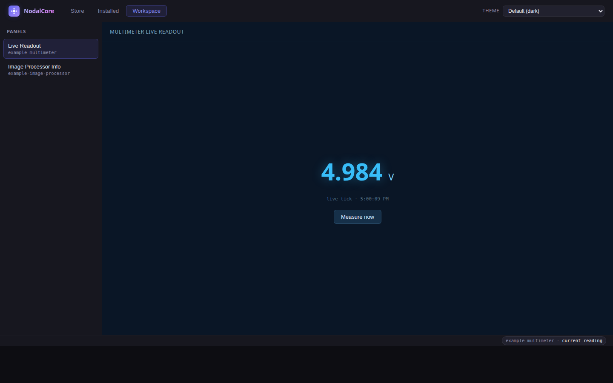
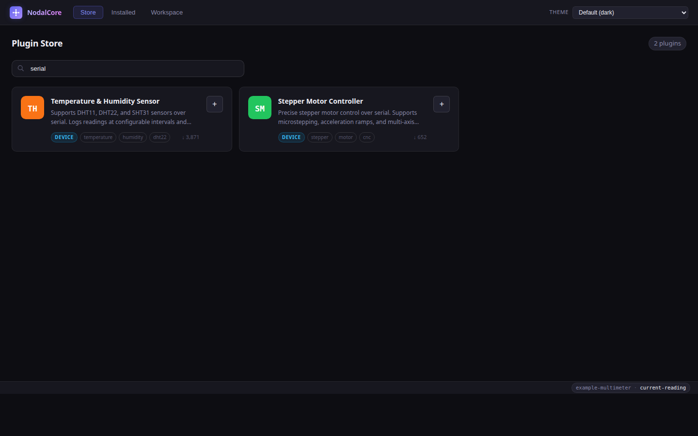
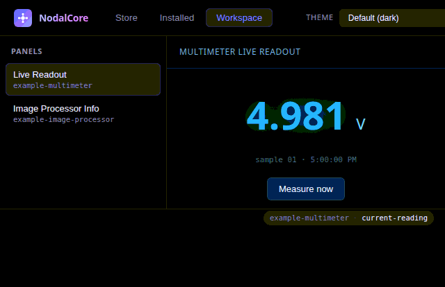
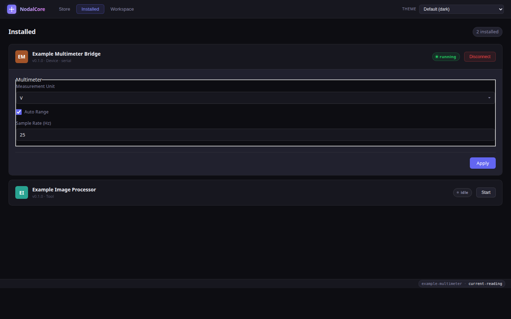
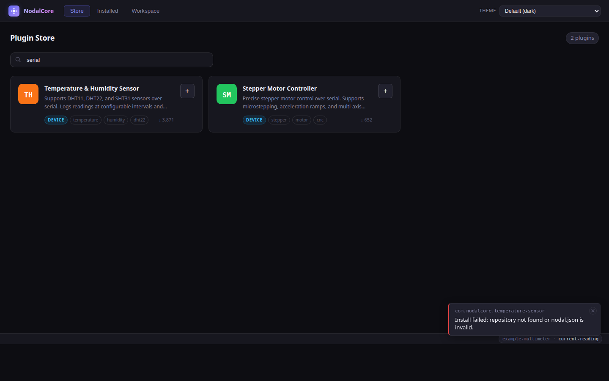

<div align="center">

# NodalCore

A desktop hub for hardware-integration plugins, modeled on VSCode's
extension architecture. Wrap a serial/USB/BLE device, ship a standalone
analysis tool, or contribute themes and panel webviews — all from a single
`nodal.json` manifest.



</div>

---

## Highlights

- **Two plugin shapes, one host API.** Device-bridge plugins run in an
  isolated Node worker; standalone tools are independent processes that
  talk to the host over gRPC. Both call the same `ctx.window.*` /
  `ctx.workspace.*` / `ctx.views.*` surface.
- **VSCode-style `contributes` block.** Themes, configuration schemas,
  sidebar/statusBar slots, and panel webviews are declared in
  `nodal.json` — no host code changes per plugin.
- **Native panel webviews.** Panels render in `WebContentsView` tiled into
  the Workspace tab, with a privileged `nodal-plugin://` scheme and a
  per-plugin-origin CSP.
- **Static GitHub Pages registry.** Plugin updates land via PR. Zero ops.

## Screenshots

### Plugin Store
Browse the registry, search by name or tag, install with one click.



### Workspace — live device panel
The device-bridge example streams a multimeter readout into a panel
webview. Hot-reloads without losing connection.



### Settings — schema-driven
Plugin settings come from the `contributes.configuration` JSON Schema and
render through RJSF. No hand-coded forms.



### Error visibility
Fatal errors from the host process (failed clone, bad manifest, SDK-version
mismatch) surface as toasts so users aren't left wondering what went wrong.



## Quick start

```bash
pnpm install                # install all workspace deps
pnpm dev                    # start the desktop app with hot-reload
pnpm build                  # build everything
pnpm typecheck              # type-check everything
pnpm lint                   # lint
```

> **Heads up:** if your environment sets `ELECTRON_RUN_AS_NODE=1`, the desktop
> dev script clears it for you through a small Node wrapper
> (`apps/desktop/scripts/dev.mjs`) that runs `delete process.env.ELECTRON_RUN_AS_NODE`
> before launching `electron-vite dev`. Works identically on POSIX shells and
> Windows.

## Repo layout

```
apps/
  desktop/   Electron shell — main process, preload, renderer (Vite)
  web/       Read-only Vite catalog browser (no device access)
  cli/       Node.js CLI, REPL, MCP server over stdio

packages/
  sdk/             @nodalcore/sdk — types + host API surface
  plugin-host/     installer, IPC loader, tool spawner, broker
  registry-client/ fetch/search the remote registry
  renderer/        React components shared by desktop + web

examples/
  plugin-device-bridge/    Multimeter over serial — reference impl
  plugin-standalone-tool/  Image processor — reference impl

docs/   Architecture, host API, plugin spec, packaging guides
```

## Writing a plugin

Start from one of the references and read the docs:

- `examples/plugin-device-bridge/` — a serial-attached multimeter
- `examples/plugin-standalone-tool/` — an image processor over gRPC
- [`docs/plugin-spec.md`](docs/plugin-spec.md) — manifest schema
- [`docs/host-api.md`](docs/host-api.md) — `ctx.window` / `ctx.workspace` / `ctx.views`
- [`docs/webviews.md`](docs/webviews.md) — panel webview rules
- [`docs/architecture.md`](docs/architecture.md) — how the pieces fit
- [`docs/plugin-packaging.md`](docs/plugin-packaging.md) — bundling for distribution

## Contributing

See [`docs/contributing.md`](docs/contributing.md).
